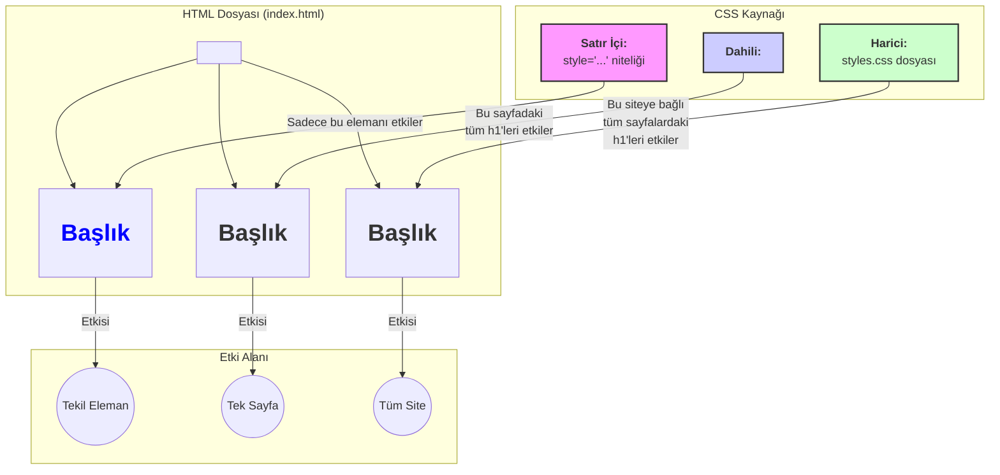

# HTML'e CSS Eklemenin 3 Yolu

Bu not, bir HTML belgesini biçimlendirmek için kullanılan CSS (Cascading Style Sheets) kodunun sayfaya nasıl dahil edileceğini ve bu yöntemlerin avantaj/dezavantajlarını basit bir dille açıklar.

---

## Yöntemlerin Görsel Karşılaştırması



---

## 1. Satır İçi CSS (Inline CSS)

- **Nasıl Çalışır?** CSS kodu, `style` niteliği (attribute) kullanılarak doğrudan stil verilmek istenen HTML etiketinin **açılış etiketinin içine** yazılır.
- **Yapısı:** `<etiketAdı style="özellik: değer;">`
- **Örnek:**
  ```html
  <h1 style="color: blue;">Bu başlık mavi olacak</h1>
  ```
- **Ne Zaman Kullanılır?**
  - Sadece **tek bir HTML elemanına** özel, küçük bir stil değişikliği yapmak için.
  - Hızlıca bir şeyleri test etmek için.
- **Dezavantajı:** Çok zahmetlidir. Aynı stili birden çok elemana uygulamak için her birine tek tek eklemek gerekir. Genellikle **kullanımı tavsiye edilmez**.

## 2. Dahili CSS (Internal CSS)

- **Nasıl Çalışır?** CSS kodları, HTML dosyasının `<head>` bölümü içine yerleştirilen `<style>` etiketleri arasına yazılır.
- **Yapısı:**
  ```html
  <head>
    <style>
      h1 {
        color: red;
      }
    </style>
  </head>
  ```
- **Ne Zaman Kullanılır?**
  - Sadece **tek bir HTML sayfasına** özgü stiller tanımlamak için.
- **Dezavantajı:** Stiller sadece o sayfada geçerlidir. Çok sayfalı bir web sitesinde aynı stilleri kullanmak isterseniz, bu kod bloğunu her sayfaya kopyalamanız gerekir, bu da verimsizdir.

## 3. Harici CSS (External CSS)

- **Nasıl Çalışır?** Tüm CSS kodları `.css` uzantılı ayrı bir dosyaya (örneğin `styles.css`) yazılır. Bu dosya, HTML belgesinin `<head>` bölümüne `<link>` etiketi ile bağlanır.
- **Yapısı:**
  - **HTML Dosyası (`index.html`):
    ```html
    <head>
      <link rel="stylesheet" href="styles.css">
    </head>
    ```
  - **CSS Dosyası (`styles.css`):
    ```css
    h1 {
      color: green;
    }
    ```
- **Ne Zaman Kullanılır?**
  - **Her zaman!** Bu, web geliştirmede en yaygın, en verimli ve en çok tavsiye edilen yöntemdir.
- **Avantajı:** Tek bir CSS dosyası ile tüm web sitesinin (yüzlerce sayfanın bile) stilini kontrol edebilirsiniz. Değişiklik yapmak çok kolaydır ve kod daha düzenli kalır.

---

## Birine Anlatır Gibi (Feynman Tekniği Özeti)

**Soru:** HTML sayfamdaki yazıların rengini, boyutunu falan nasıl değiştiririm? Yani CSS'i nasıl eklerim?

**Cevap:** Üç yolun var, ama sen genellikle sonuncusunu kullanacaksın:

1.  **Satır İçi (Acil Durum Yöntemi):** Sadece tek bir başlığın rengini değiştirmek gibi küçük bir işin varsa, `<h1>` etiketinin içine `style="color: blue;"` yazabilirsin. Ama bu çok pratik değil, unut gitsin.

2.  **Dahili (Tek Sayfalık Site Yöntemi):** Sadece o an çalıştığın tek bir HTML sayfasına özel stiller yazmak istersen, `<head>` etiketlerinin arasına `<style>` diye bir etiket açıp tüm CSS kodunu oraya yazabilirsin. Ama sitende birden çok sayfa varsa bu da işe yaramaz.

3.  **Harici (Profesyonel Yöntem):** İşte bu doğru olanı! Bütün CSS kodlarını `styles.css` gibi ayrı bir dosyaya yaz. Sonra HTML dosyanın `<head>` kısmına `<link rel="stylesheet" href="styles.css">` diye tek bir satır ekleyerek bu dosyayı çağır. Artık o CSS dosyası bütün siteni kontrol eder. Hem düzenli hem de çok pratik!