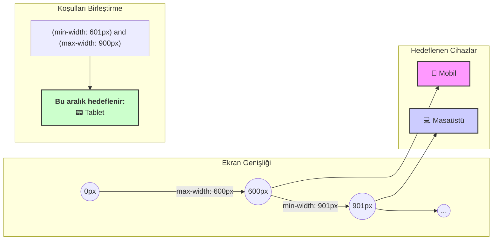

# CSS Medya Sorguları (Media Queries)

Bu not, bir web sitesinin farklı ekran boyutlarına, yönelimlerine veya diğer cihaz özelliklerine göre farklı CSS kuralları uygulamasını sağlayan Medya Sorguları (`@media`) konseptini basit bir dille açıklar.

## Medya Sorgusu Nedir?

Medya sorgusu, CSS içinde bir "eğer... o zaman..." koşulu oluşturmanın bir yoludur. Temel olarak, "Eğer ekran şu özelliklere sahipse, o zaman bu CSS kurallarını uygula" dememizi sağlar. Bu, duyarlı tasarımın temelini oluşturur.

### Temel Sözdizimi (Syntax)

```css
@media (özellik: değer) {
  /* Koşul sağlandığında uygulanacak CSS kuralları */
  selector {
    property: value;
  }
}
```

- **`@media`**: Medya sorgusunu başlatan anahtar kelimedir.
- **`(özellik: değer)`**: Koşulun belirtildiği kısımdır. Bu koşullara **kırılma noktası (breakpoint)** denir.

---

## En Yaygın Medya Özellikleri: `max-width` ve `min-width`

### 1. `max-width` (Maksimum Genişlik)
- **Anlamı:** "Ekran genişliği belirtilen değerden **daha küçük veya eşitse**" anlamına gelir.
- **Kullanım Amacı:** Genellikle mobil cihazlar gibi küçük ekranları hedeflemek için kullanılır ("mobile-first" yaklaşımının tersi).
- **Örnek:**
  ```css
  /* Ekran 600px veya daha darsa, arka plan rengi pembe olsun */
  @media (max-width: 600px) {
    body {
      background-color: pink;
    }
  }
  ```

### 2. `min-width` (Minimum Genişlik)
- **Anlamı:** "Ekran genişliği belirtilen değerden **daha büyük veya eşitse**" anlamına gelir.
- **Kullanım Amacı:** Genellikle masaüstü gibi büyük ekranları hedeflemek için kullanılır ("mobile-first" yaklaşımında yaygındır).
- **Örnek:**
  ```css
  /* Ekran 900px veya daha genişse, yazı boyutu 20px olsun */
  @media (min-width: 900px) {
    p {
      font-size: 20px;
    }
  }
  ```

### Kırılma Noktalarının Görsel Anlatımı



---

## Koşulları Birleştirme

`and` anahtar kelimesini kullanarak birden fazla koşulu birleştirebilir ve belirli bir aralığı hedefleyebilirsiniz.

```css
/* Ekran genişliği 601px ile 900px arasındaysa (tabletler gibi) */
@media (min-width: 601px) and (max-width: 900px) {
  body {
    background-color: lightgreen;
  }
}
```

## Diğer Medya Türleri

Medya sorguları sadece ekran genişliğini değil, başka özellikleri de hedefleyebilir:

- **`screen`**: Normal ekranlar için (varsayılan değerdir, genellikle yazılmaz).
- **`print`**: Sayfa yazdırıldığında uygulanacak stiller için. Örneğin, yazdırma sırasında linklerin ve menülerin gizlenmesini sağlayabilirsiniz.
- **`orientation: landscape`**: Ekran yatay konumdayken uygulanacak stiller için.

---

## Birine Anlatır Gibi (Feynman Tekniği Özeti)

**Soru:** Web sitemin telefonda farklı, bilgisayarda farklı görünmesini nasıl sağlarım?

**Cevap:** CSS'e sihirli bir komut olan `@media` ile talimatlar vererek.

- **Telefona özel stil için:**
  `@media (max-width: 600px) { ... }` yazarsın. Bu, "Eğer ekran 600 pikselden darsa, bu süslü parantezlerin içindeki stilleri uygula" demektir. Genellikle telefon ekranları bu aralıktadır.

- **Büyük ekranlara özel stil için:**
  `@media (min-width: 900px) { ... }` yazarsın. Bu da, "Eğer ekran 900 pikselden genişse, bu stilleri uygula" demektir.

- **Sadece tabletler gibi bir aralık için:**
  İkisini `and` ile birleştirirsin: `@media (min-width: 601px) and (max-width: 900px) { ... }`

Kısacası, `@media` komutuyla farklı ekran boyutları için farklı "kırılma noktaları" belirleyip her birine özel CSS kuralları yazarak siteni her cihaza uyumlu hale getirirsin.
