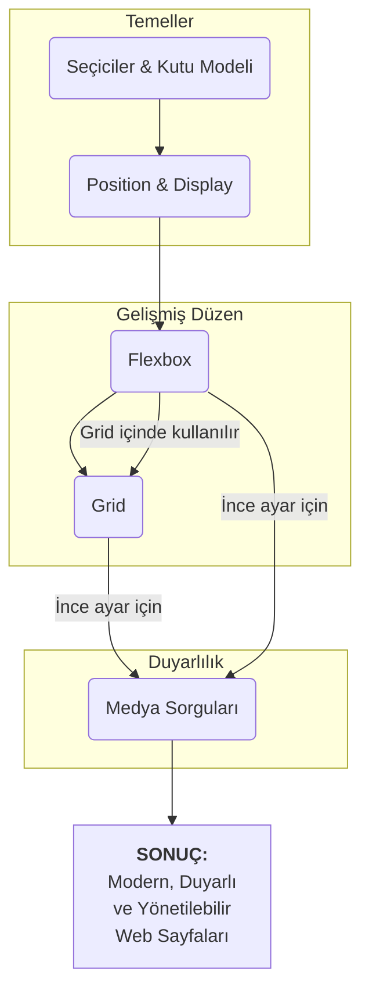

# CSS Öğrenme Yol Haritası ve Genel Bakış

Bu belge, mevcut ders notları analiz edilerek oluşturulmuş bir CSS öğrenme yol haritası ve temel kavramlar özetidir. Amacı, öğrenme sürecini yapılandırmak ve kritik konular arasındaki bağlantıları görselleştirmektir.

---

## 1. CSS'in Temel Yapı Taşları

Her şeyden önce, CSS'in nasıl çalıştığını ve temel sözdizimini anlamak gerekir. Bu temel, üzerine diğer tüm bilgileri inşa edeceğimiz zemindir.

| Konu | Açıklama | Kritik Bilgi |
| :--- | :--- | :--- |
| **CSS Ekleme Yöntemleri** | CSS kodunu HTML'e dahil etmenin 3 yolu: Satır içi, Dahili ve Harici. | **Harici (`<link>`) yöntem en iyi pratiktir.** Kodun düzenli ve yönetilebilir kalmasını sağlar. |
| **Seçiciler (Selectors)** | Stilleri doğru HTML elemanlarına uygulamak için kullanılır. | **ID (`#`)** benzersiz bir eleman için, **Sınıf (`.`)** ise birden çok eleman için kullanılır. Bu en temel farktır. |
| **Temel Özellikler** | `color`, `background-color`, `font-size`, `font-family` gibi temel stil özellikleri. | Renkler için **Hex kodları** (`#RRGGBB`), yazı tipi boyutları için **`rem`** birimi modern standartlardır. |
| **Kutu Modeli (Box Model)** | Her elemanın bir kutu olduğunu ve bu kutunun `margin`, `border`, `padding` katmanlarından oluştuğunu anlatan model. | **`margin` dış boşluk, `padding` iç boşluktur.** Bu ayrım, düzen oluşturmanın temelidir. |
| **CSS Cascade** | Birden fazla stil çakıştığında hangisinin kazanacağını belirleyen öncelik sistemi. | **Özgüllük (Specificity)** en önemli kuraldır: **ID > Sınıf > Element**. |

---

## 2. Sayfa Düzeni (Layout) Evrimi

Web sayfalarını yapılandırma yöntemleri zamanla gelişmiştir. Bu evrimi anlamak, modern araçların neden bu kadar güçlü olduğunu kavramamıza yardımcı olur.

```mermaid
graph TD
    A[<b>Eski Yöntemler</b><br/>(Tablolar, Float)] --> B{<b>Ara Dönem</b><br/>(Position, Display)}
    B --> C[<b>Modern Düzen (Layout)</b><br/>Flexbox & Grid]

    subgraph "Modern Araçlar"
        D[<b>Flexbox (1D)</b><br/>Tek boyutlu hizalama<br/>(Menüler, kart içi öğeler)]
        E[<b>Grid (2D)</b><br/>İki boyutlu düzen<br/>(Tüm sayfa iskeleti)]
    end

    C --> D & E

    style A fill:#ffcccc
    style B fill:#cce5ff
    style C fill:#d4edda
```

### Düzen Teknikleri Hiyerarşisi

1.  **Temel Akış ve Konumlandırma (`position`):**
    -   Elemanları normal akıştan çıkarıp hassas bir şekilde konumlandırmak için kullanılır.
    -   `position: relative;` genellikle `position: absolute;` ile konumlandırılacak bir çocuğun "çerçevesi" olarak kullanılır.

2.  **Tek Boyutlu Hizalama (`display: flex`):**
    -   **Ne zaman?** Elemanları tek bir satırda veya sütunda hizalamak, sıralamak ve aralarındaki boşluğu dağıtmak gerektiğinde.
    -   **Anahtar Kavramlar:** `flex-direction` (ana ekseni belirler), `justify-content` (ana eksende hizalama), `align-items` (çapraz eksende hizalama).

3.  **İki Boyutlu Düzen (`display: grid`):**
    -   **Ne zaman?** Tüm sayfanın iskeletini (header, sidebar, main, footer) oluşturmak gibi karmaşık, hem satır hem de sütun gerektiren düzenler için.
    -   **Anahtar Kavramlar:** `grid-template-columns/rows` (ızgara planını çizer), `fr` birimi (esnek boyutlandırma), `grid-area` (öğeleri yerleştirme).

**Kritik Not:** Flexbox ve Grid rakip değildir, **takım arkadaşıdır**. Genellikle bir `grid` hücresinin içindeki öğeleri hizalamak için `flexbox` kullanılır.

---

## 3. Duyarlı (Responsive) Tasarım

Web sitesinin farklı ekran boyutlarına uyum sağlamasıdır. Bu, modern web geliştirmenin vazgeçilmez bir parçasıdır.

### Duyarlılık Araç Kutusu

| Araç | Görevi | Ne Zaman Kullanılır? |
| :--- | :--- | :--- |
| **Medya Sorguları (`@media`)** | **Kırılma Noktaları:** Belirli ekran genişliklerinde CSS kurallarını tamamen değiştirmek. | "Ekran 600px'den küçükse, menüyü gizle" gibi radikal değişiklikler için. |
| **Esnek Düzenler (Flex & Grid)** | **Akışkanlık:** Düzenin ekran boyutu değiştikçe doğal olarak akmasını ve uyum sağlamasını sağlamak. | Düzenin temelini oluştururken. `fr` birimi ve `flex-wrap` gibi özellikler burada parlar. |
| **Göreceli Birimler (`rem`, `%`)** | **Ölçeklenebilirlik:** Yazı tiplerinin ve boşlukların genel bir orana göre büyümesini/küçülmesini sağlamak. | `px` gibi sabit birimler yerine daha esnek bir yapı kurmak için. |

### Öğrenme Akış Diyagramı



Bu yol haritası, temel kavramlardan başlayarak modern ve karmaşık düzenleme tekniklerine doğru ilerleyen yapılandırılmış bir öğrenme süreci sunar. Her adım, bir sonrakinin temelini oluşturur.
