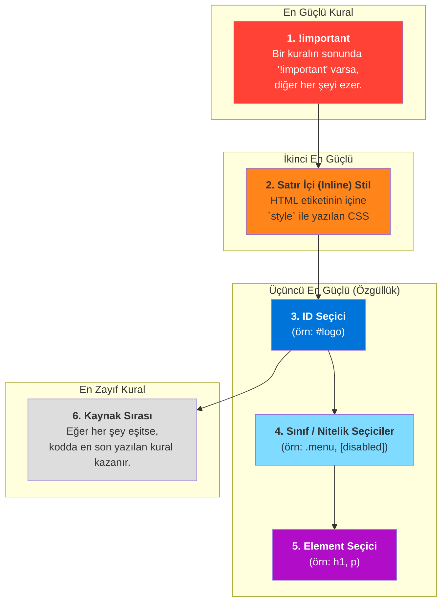

# CSS Cascade (Çağlayan): Hangi Kural Kazanır?

Bu not, CSS'in neden "Cascading" (Çağlayan/Basamaklı) olarak adlandırıldığını ve bir HTML elemanına birden fazla çakışan stil kuralı uygulandığında tarayıcının hangisini seçeceğini nasıl belirlediğini basit bir dille açıklar.

## Cascade (Çağlayan) Nedir?

Cascade, aynı elemanı hedefleyen birden fazla CSS kuralı olduğunda, hangi kuralın uygulanacağını belirleyen bir öncelik (hiyerarşi) sistemidir. Tarayıcı, bu kuralları bir çağlayan gibi yukarıdan aşağıya değerlendirir ve en sonunda hangi stilin "kazanacağını" belirler.

## Öncelik Belirleme Kuralları (En Önemliden En Az Önemliye)

Tarayıcı, bir stilin ne kadar önemli olduğuna karar vermek için dört ana kategoriye bakar:

1.  **Önem (Importance):** `!important` anahtar kelimesi.
2.  **Özgüllük (Specificity):** Seçicinin ne kadar spesifik olduğu (ID > Sınıf > Element).
3.  **Kaynak Sırası (Source Order):** CSS kodunun nerede ve ne zaman yazıldığı.

### Öncelik Hiyerarşisi Diyagramı

---

## Kuralların Detaylı Açıklaması

1.  **`!important` Kuralı:**
    - Bir CSS özelliğinin sonuna `!important` eklerseniz, bu kural diğer tüm kuralları (satır içi stiller, ID'ler dahil) geçersiz kılar. Çok güçlü olduğu için dikkatli kullanılmalıdır, genellikle son çare olarak başvurulur.
    - **Örnek:** `p { color: red !important; }`

2.  **Özgüllük (Specificity):**
    - Seçicinin ne kadar "özel" veya "hedefe yönelik" olduğunu ifade eder.
    - **Hiyerarşi:**
        - **ID Seçici (`#id`):** En özgül olanıdır. (En güçlü)
        - **Sınıf (`.class`), Nitelik (`[type]`), Sözde Sınıf (`:hover`):** Orta derecede özgüldür.
        - **Element Seçici (`h1`, `div`):** En az özgül olanıdır. (En zayıf)
    - **Örnek:** Bir elemanın hem ID'si hem de sınıfı varsa, ID seçici ile verilen stil, sınıf seçici ile verilen stili ezer.

3.  **Kaynak Sırası (Source Order):**
    - **Konum:** Eğer iki kuralın özgüllüğü tamamen aynıysa, CSS dosyasında **en son yazılan** kural geçerli olur. Tarayıcı kodu yukarıdan aşağıya okur ve sonraki kurallar öncekilerin üzerine yazar.
    - **CSS Ekleme Türü:** Eğer her şey eşitse, stillerin uygulanma önceliği şöyledir:
        1.  **Satır İçi (Inline) CSS:** (En güçlü)
        2.  **Dahili (Internal) CSS:** (`<style>` etiketi içinde)
        3.  **Harici (External) CSS:** (`.css` dosyası) (En zayıf)

---

## Birine Anlatır Gibi (Feynman Tekniği Özeti)

**Soru:** Bir başlığın rengini hem sınıfıyla hem de ID'siyle değiştirmeye çalışıyorum. Hangisi kazanır? Neden?

**Cevap:** Tarayıcı bir stil kavgası olduğunda kimin kazanacağına karar vermek için bir öncelik listesine bakar. Bu listeye "Cascade" (Çağlayan) denir.

1.  **En Güçlü Koz: `!important`**
    - Bir kuralın sonuna bunu yazarsan, o kural tartışmasız kazanır. Ama bunu çok kullanma, ortalığı karıştırabilir.

2.  **En Özel Olan Kazanır (Özgüllük):**
    - **ID (`#`):** Bir kişiyi adıyla çağırmak gibidir, çok özeldir. Bu yüzden en güçlüsüdür.
    - **Sınıf (`.`):** Bir grup insanı "gözlüklüler" diye çağırmak gibidir. Özeldir ama ID kadar değil.
    - **Etiket (`h1`):** Odadaki "herkes" demek gibidir. En genel olanıdır, bu yüzden en zayıfıdır.
    - Yani, ID her zaman sınıfı, sınıf da her zaman etiketi yener.

3.  **En Son Söyleyen Kazanır (Sıra):**
    - Eğer iki kuralın gücü aynıysa (mesela ikisi de sınıf seçiciyse), kodda **en altta yazan** kazanır.

Kısacası, tarayıcı önce `!important` var mı diye bakar, sonra kim daha özel (ID mi, sınıf mı) diye bakar, eğer hala eşitlik varsa en son kim söylemiş diye bakar. İşte CSS'in sırrı bu!
