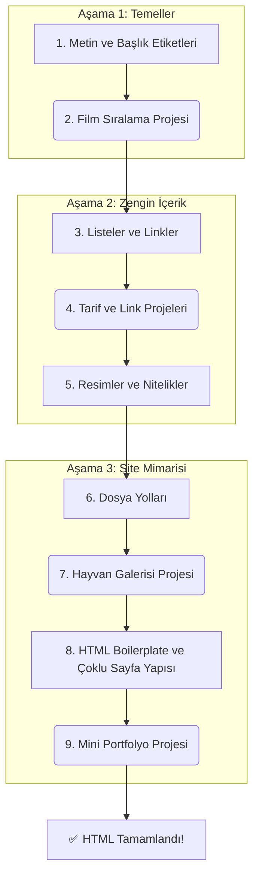

# HTML Öğrenme Yol Haritası

Bu belge, bu kurstaki HTML bölümünün tamamı için bir yol haritası ve özet niteliğindedir. Her bir adımda hangi konuların işlendiğini, ne anlama geldiklerini ve bu bilgileri pekiştirmek için hangi mini projelerin yapıldığını bulabilirsiniz.

---

## Görsel Özet Tablosu

| Bölüm | Ana Odak | Anahtar Kavramlar/Etiketler | İlgili Proje |
| :--- | :--- | :--- | :--- |
| **1. HTML'e Giriş** | Temel Sayfa Yapısı ve Metin | `<h1>`-`<h6>`, `
`, `
`, ` ` | Film Sıralama Projesi |
| **2. Orta Seviye HTML** | Zengin ve Etkileşimli İçerik | `<ul>`, `<ol>`, `<li>`, `<a>`, ``, Nitelikler (`href`, `src`, `alt`) | Tarçınlı Çörek Tarifi, Favori Siteler |
| **3. Çok Sayfalı Siteler** | Site Mimarisi ve Yapısı | Dosya Yolları (`./`, `../`), Boilerplate, Sayfalar arası linkleme | Hayvan Galerisi, Mini Portfolyo |

---

## Öğrenme Akış Diyagramı

---

## Bölüm 1: HTML'e Giriş (Temeller)

Bu bölümde, bir web sayfasının en temel yapı taşlarını öğrendik. Amaç, statik içerik oluşturmanın mantığını kavramaktı.

### Öğrenilen Konular:

- **Başlık Etiketleri (`<h1>` - `<h6>`):** Sayfa içeriğini hiyerarşik bir düzende organize etmek için kullanılan başlıkları oluşturmayı öğrendik.
- **Paragraf Etiketi (`
`):** Metin blokları yazmak için temel paragraf etiketini kullandık.
- **Boş Elemanlar (Void Elements - `
`, ` `):** Kapanış etiketi olmayan ve genellikle içerik ayırmak (yatay çizgi) veya satır atlamak için kullanılan özel etiketleri tanıdık.

### Yapılan Proje:

- **Film Sıralama Projesi:** Öğrendiğimiz başlık ve paragraf etiketlerini kullanarak en sevdiğimiz filmleri listeleyen basit, yapılandırılmış bir web sayfası oluşturduk. Bu proje, temel etiketlerin bir arada nasıl kullanıldığını anlamamızı sağladı.

---

## Bölüm 2: Orta Seviye HTML

Temellerin üzerine koyarak daha zengin ve etkileşimli içerikler oluşturmamızı sağlayan etiketleri ve nitelikleri keşfettik.

### Öğrenilen Konular:

- **Liste Elemanları (`<ul>`, `<ol>`, `<li>`):** Maddelerin sırasının önemli olduğu (numaralı - `<ol>`) ve olmadığı (madde imli - `<ul>`) listeler oluşturmayı öğrendik.
- **İç İçe Yapılar ve Girintileme:** Listeleri birbirinin içine yerleştirerek daha karmaşık hiyerarşiler kurmayı ve kodun okunabilirliği için girintilemenin (indentation) önemini kavradık.
- **Çapa (Link) Etiketleri (`<a>`):** `href` niteliğini kullanarak başka web sayfalarına veya sitelere tıklanabilir linkler vermeyi öğrendik.
- **Resim Etiketleri (``):** `src` niteliği ile sayfalara resim eklemeyi ve erişilebilirlik için `alt` niteliğinin neden hayati olduğunu anladık.

### Yapılan Projeler:

- **Tarçınlı Çörek Tarifi:** Sıralı ve sırasız listeleri kullanarak bir yemek tarifinin malzemelerini ve adımlarını biçimlendirdik.
- **Favori Web Siteleri Listesi:** Bir sıralı liste içinde, her biri farklı bir siteye giden aktif linkler (`<a>` etiketi) oluşturduk.
- **Kedi/Köpek İnsanı Projesi:** Sayfaya `` etiketiyle bir görsel (GIF dahil) eklemeyi ve `alt` metnini doğru şekilde kullanmayı pratik ettik.

---

## Bölüm 3: Çok Sayfalı Web Siteleri Mimarisi

Tek bir sayfadan oluşan web sitelerinden, birden çok sayfadan oluşan ve aralarında gezinebilen tam teşekküllü site yapılarına geçiş yaptık.

### Öğrenilen Konular:

- **Dosya Yolları (File Paths):** Bir HTML dosyasının, projenin başka bir yerindeki bir kaynağa (resim, başka bir HTML dosyası vb.) nasıl eriştiğini öğrendik. Göreli yollar (`./`, `../`) ve web geliştirmedeki önemini anladık.
- **Çok Sayfalı Yapılar:** "Hakkımızda", "İletişim" gibi farklı HTML dosyaları oluşturup bunları ana sayfa (`index.html`) üzerinden birbirine bağlayarak çok sayfalı bir site mimarisi kurduk.
- **HTML Boilerplate (Standart Şablon):** Her HTML sayfasının temel iskeletini oluşturan `<!DOCTYPE>`, `<html>`, `<head>`, ve `<body>` gibi temel etiketlerin ne anlama geldiğini ve neden gerekli olduğunu öğrendik.

### Yapılan Projeler:

- **Hayvan Resimleri Galerisi:** Karmaşık ve iç içe klasör yapılarından doğru hayvan resimlerini bulup göstermeye çalışarak göreli dosya yollarını kullanma becerimizi test ettik.
- **Mini Portfolyo Sitesi Taslağı:** Ana sayfadan "Hakkımda" ve "İletişim" sayfalarına linkler verdik. Ayrıca bir resme tıklandığında başka bir sayfaya gitmesini sağlayarak öğrendiğimiz birden çok konsepti birleştirdik.

Bu yol haritasını tamamladığınızda, HTML kullanarak sağlam, çok sayfalı ve statik web siteleri oluşturmak için gerekli tüm temel bilgi ve becerilere sahip olacaksınız.