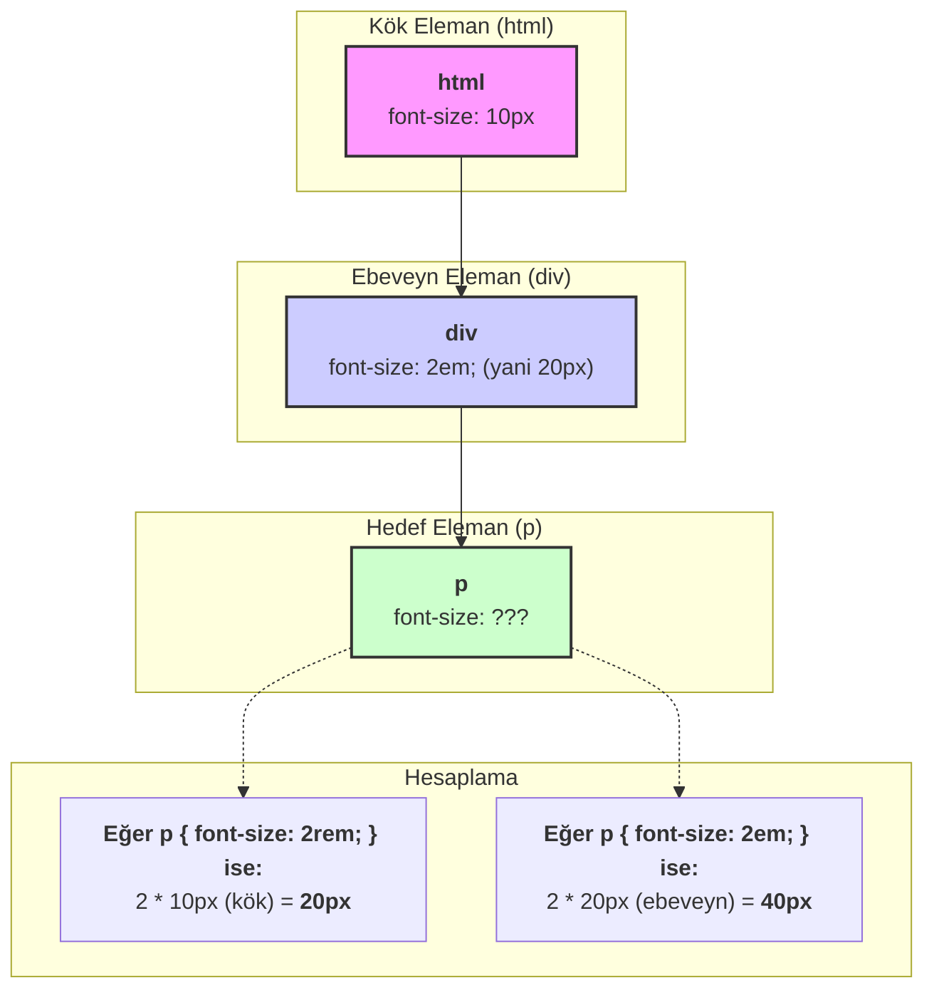

# CSS Yazı Tipi (Font) Özellikleri

Bu not, web sayfalarındaki metinlerin görünümünü kontrol etmek için kullanılan temel CSS yazı tipi (font) özelliklerini ve boyutlandırma birimlerini basit bir dille açıklar.

## Temel Yazı Tipi Özellikleri

- **`font-size`**: Metnin boyutunu ayarlar. Farklı birimler alabilir (aşağıda detaylandırılmıştır).
- **`font-weight`**: Metnin kalınlığını ayarlar. `normal`, `bold` veya `100` ile `900` arasında sayısal değerler alabilir.
- **`font-family`**: Metnin yazı tipini belirler. `Arial`, `Verdana` gibi belirli font isimleri veya `serif` (tırnaklı), `sans-serif` (tırnaksız) gibi genel aile isimleri alabilir.
- **`text-align`**: Metnin yatay hizalamasını kontrol eder. `left`, `right`, `center` gibi değerler alır.

---

## `font-size` Birimleri: `px`, `em` ve `rem`

En yaygın kullanılan boyut birimleri şunlardır:

- **`px` (Piksel):** Ekrana göre sabit bir boyut birimidir. Kesin ve değişmez bir boyut istendiğinde kullanılır.
- **`em`**: İçinde bulunduğu **ebeveyn (parent) elemanın** yazı tipi boyutuna göre orantılıdır. Örneğin, ebeveynin yazı tipi `16px` ise, `2em` olarak ayarlanan bir elemanın yazı tipi `32px` olur.
- **`rem` (Root em):** **Her zaman kök elemanın (`<html>`)** yazı tipi boyutuna göre orantılıdır. Bu, iç içe geçmiş elemanlarda bile tutarlı ve öngörülebilir bir boyutlandırma sağlar.

**Tavsiye:** Genellikle web sitelerinde tutarlılığı korumak için **`rem`** birimini kullanmak en iyi pratiktir.

### `em` ve `rem` Arasındaki Fark (Görsel Anlatım)



---

## Özel Yazı Tipleri Nasıl Eklenir? (Google Fonts)

Web sitenizde standart yazı tiplerinin dışında özel bir font kullanmak için en popüler yöntem [Google Fonts](https://fonts.google.com/) kullanmaktır.

1.  **Seç:** Google Fonts sitesinden beğendiğiniz bir yazı tipini ve kalınlığını seçin.
2.  **Kopyala:** Sağ tarafta açılan menüden `<link>` etiketlerini kopyalayın.
3.  **Yapıştır:** Kopyaladığınız `<link>` etiketlerini HTML dosyanızın `<head>` bölümüne yapıştırın.
4.  **Kullan:** Yine aynı menüde verilen `font-family` CSS kuralını kopyalayıp stil dosyanızda ilgili seçici için kullanın.

```css
/* Google Fonts'tan alınan CSS kuralı */
h1 {
  font-family: 'Caveat', cursive;
}
```

---

## Birine Anlatır Gibi (Feynman Tekniği Özeti)

**Soru:** Sayfamdaki metinlerin tipini, boyutunu ve kalınlığını nasıl değiştiririm?

**Cevap:** Birkaç basit özellikle:

- **Boyut için (`font-size`):** `rem` kullan. `1rem` normal boyut, `2rem` iki katı demek. Bu, sitenin her yerinde tutarlı bir büyüklük sağlar.
- **Kalınlık için (`font-weight`):** `bold` yaz ya da daha fazla kontrol için `100` (en ince) ile `900` (en kalın) arasında bir sayı ver.
- **Yazı Tipi için (`font-family`):** Havalı ve ücretsiz fontlar için Google Fonts'a git. Beğendiğini seç, sana vereceği `<link>` kodunu HTML'nin `<head>` kısmına, CSS kodunu da stil dosyana yapıştır. Bu kadar!
- **Hizalama için (`text-align`):** Metni ortalamak için `center`, sağa yaslamak için `right` yazman yeterli.
