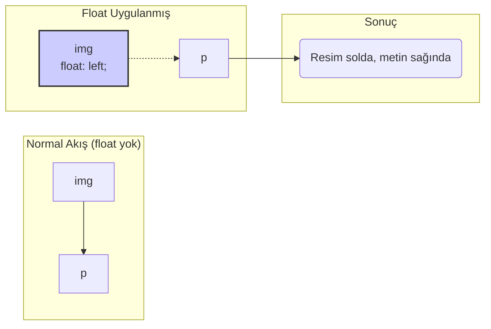

# CSS Float ve Clear Özellikleri

Bu not, metnin bir resim gibi elemanın etrafına sarılmasını sağlayan `float` özelliğini ve bu kaydırma davranışını kontrol etmek için kullanılan `clear` özelliğini basit bir dille açıklar.

## `float` Özelliği Nedir?

`float` özelliği, bir elemanı normal belge akışından çıkarır ve onu içeren kabın (container) sağına veya soluna kaydırır. Bu özelliğin en temel ve modern kullanım amacı, bir resmin yanına metin yerleştirerek gazete veya dergi benzeri bir düzen oluşturmaktır.

- **Nasıl Çalışır?** Bir elemana `float: left;` veya `float: right;` uygulandığında, o eleman sola veya sağa "yüzer" ve kendisinden sonra gelen diğer içerikler onun etrafını sarmaya başlar.

### Görsel Anlatım



---

## `clear` Özelliği: Kaydırmayı Temizleme

Bazen bir elemanın, üstündeki kaydırılmış (floated) bir elemanın etrafını sarmasını istemeyiz. Örneğin, bir altbilginin (footer) her zaman sayfanın tam genişliğinde, kaydırılmış sütunların altında başlamasını isteriz.

- **Nasıl Çalışır?** `clear` özelliği, bir elemanın üstündeki kayan elemanların altına itilmesini sağlar. Yani, o elemanın sağında, solunda veya her iki tarafında da kayan bir eleman olmasına izin vermez.
- **Değerleri:**
  - `clear: left;` -> Solda kayan elemanların altına iter.
  - `clear: right;` -> Sağda kayan elemanların altına iter.
  - `clear: both;` -> Hem solda hem de sağda kayan elemanların altına iter. (En sık kullanılan değerdir).

### `clear` Kullanımı

```html

<p>Bu metin resmin etrafını sarar.</p>
<footer style="clear: both;">Bu altbilgi, resmin altına iner.</footer>
```

---

## Önemli Not: Modern CSS ve `float`

Geçmişte, geliştiriciler tüm sayfa düzenini (sütunlar oluşturmak gibi) `float` kullanarak yaparlardı. Ancak bu yöntem karmaşık ve kırılgandı.

**Modern web geliştirmede, `float` özelliği sayfa düzeni oluşturmak için KULLANILMAZ.**

Bunun yerine **Flexbox** ve **Grid** gibi çok daha güçlü ve esnek araçlar kullanılır. `float`'ı sadece asıl amacı için, yani **bir metni bir resmin etrafına sarmak için** kullanmalısınız.

---

## Birine Anlatır Gibi (Feynman Tekniği Özeti)

**Soru:** Bir resmin yanına nasıl yazı koyarım, dergilerdeki gibi?

**Cevap:** Resme `float: left;` stilini ver. Bu, resmi sola "yüzdürür" ve ardından gelen metin otomatik olarak onun sağ tarafına yerleşip etrafını sarar. İşte bu kadar basit!

**Peki ya bir sonraki başlığın yazının etrafını sarmasını istemiyorsam, normal bir şekilde altta başlamasını istiyorsam?**

O zaman o başlığa `clear: both;` stilini verirsin. Bu, o başlığa "Hey, yukarıda yüzen kimse varsa onu bekleme, sen normal bir şekilde en alttan başla" demek gibidir. `clear` özelliği, `float`'ın yarattığı sarma davranışını iptal eder.

**Unutma:** `float`'ı tüm sayfayı sütunlara bölmek gibi büyük işler için kullanma. O işler için Flexbox ve Grid var. `float` sadece metin ve resim ikilisi için harikadır.
