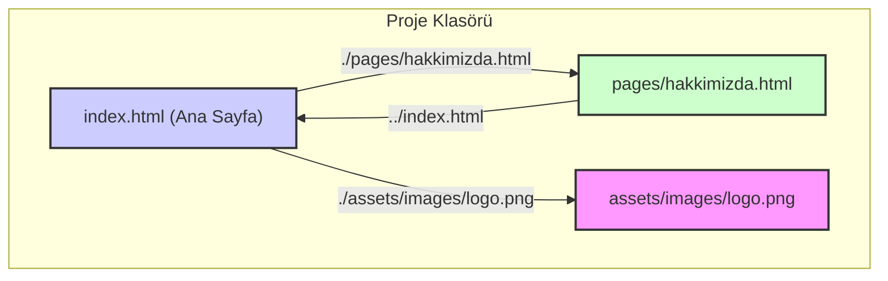
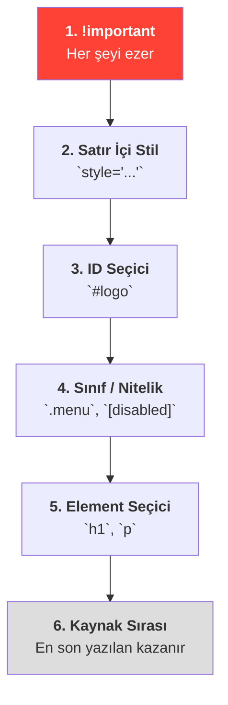
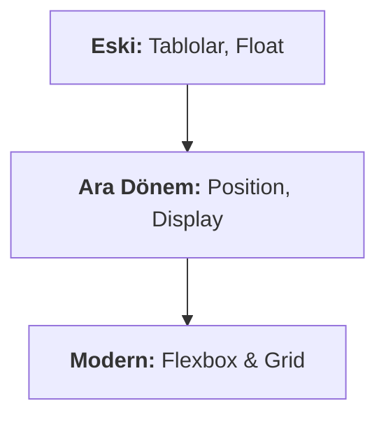
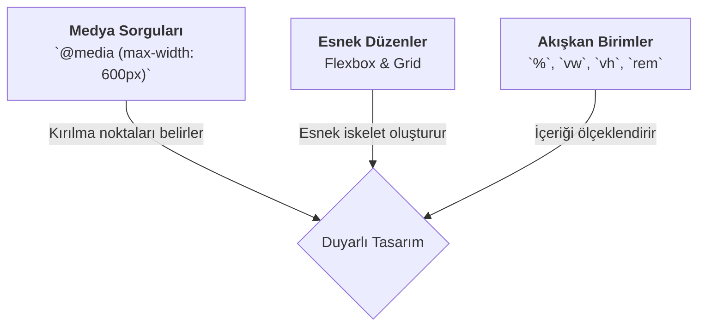

# Frontend Temelleri: HTML & CSS Yol Haritası

Bu belge, modern ve duyarlı web siteleri oluşturmanın temelini oluşturan HTML ve CSS konularını kapsayan bütüncül bir referans kaynağıdır. Sıfırdan başlayarak, yapılandırılmış bir öğrenme süreci sunar ve kritik kavramlar arasındaki bağlantıları görselleştirir.

---

## 1. Bölüm: Web'in İskeleti - HTML

HTML (HyperText Markup Language), bir web sayfasının yapısını ve içeriğini tanımlayan standart dildir. Tıpkı bir binanın iskeleti gibi, sayfanın temelini oluşturur.

### 1.1. Temel Kavramlar ve Etiketler

| Kavram/Etiket | Açıklama | Kritik Bilgi |
| :--- | :--- | :--- |
| **HTML Boilerplate** | Her HTML dosyasının standart başlangıç şablonu. | `<!DOCTYPE html>`, `<html>`, `<head>`, `<body>` etiketlerini içerir. VS Code'da `!` ile oluşturulur. |
| **Başlıklar (`<h1>`-`<h6>`)** | İçeriği hiyerarşik olarak düzenler. | Sayfada sadece **bir tane `<h1>`** olmalıdır. Hiyerarşi atlanmamalıdır (`h1`'den `h3`'e geçilmez). |
| **Paragraflar (`
`)** | Metin bloklarını tanımlar. | Sadece görsel ayrım için değil, ekran okuyucular için de anlamsal olarak önemlidir. |
| **Linkler (`<a>`)** | Başka sayfalara veya kaynaklara bağlantı oluşturur. | `href` niteliği olmadan çalışmaz. `href` gidilecek adresi belirtir. |
| **Resimler (``)** | Sayfaya görsel ekler. Boş bir elemandır. | `src` (kaynak) ve `alt` (alternatif metin) nitelikleri zorunludur. `alt` erişilebilirlik için hayatidir. |
| **Listeler (`<ul>`, `<ol>`, `<li>`)** | İçerikleri sıralı veya sırasız olarak gruplar. | `<ul>` (sırasız, madde imli), `<ol>` (sıralı, numaralı). Her liste öğesi `<li>` içine yazılır. |

### 1.2. Site Mimarisi ve Dosya Yolları

Çok sayfalı bir site, birbirine bağlı HTML dosyalarından oluşur. Bu bağlantılar **göreli dosya yolları** ile kurulur.

- **`./`**: Aynı klasörün içine bak.
- **`../`**: Bir üst klasöre çık.

---

## 2. Bölüm: Stilin Gücü - CSS

CSS (Cascading Style Sheets), HTML tarafından oluşturulan iskeleti giydiren, yani sayfanın görsel görünümünü (renkler, yazı tipleri, düzen) kontrol eden dildir.

### 2.1. CSS'in Temelleri

| Kavram | Açıklama | Kritik Bilgi |
| :--- | :--- | :--- |
| **CSS Ekleme** | Satır içi, Dahili ve Harici yöntemler. | **Harici (`<link>`) yöntem en iyi pratiktir.** Kodun düzenli ve yönetilebilir kalmasını sağlar. |
| **Seçiciler** | Stillerin hangi HTML elemanlarına uygulanacağını belirler. | **Özgüllük Hiyerarşisi:** ID (`#id`) > Sınıf (`.class`) > Element (`p`). |
| **Kutu Modeli** | Her elemanın `margin`, `border`, `padding` ve `content` alanlarından oluşan bir kutu olması. | **`margin` dış boşluk, `padding` iç boşluktur.** Bu, düzen oluşturmanın temelidir. |
| **CSS Cascade** | Çakışan stiller olduğunda hangisinin kazanacağını belirleyen öncelik sistemi. | `!important` > Satır İçi Stil > ID > Sınıf > Element > Kaynak Sırası. |

### CSS Cascade (Çağlayan) Öncelik Diyagramı

---

## 3. Bölüm: Sayfa Düzeni Sanatı (Layout)

Modern CSS, karmaşık ve esnek sayfa düzenleri oluşturmak için iki güçlü araç sunar: **Flexbox** ve **Grid**.

### Layout Evrim Diyagramı

### 3.1. Flexbox (Tek Boyutlu Düzen)
Elemanları **tek bir satır veya sütun boyunca** hizalamak, sıralamak ve dağıtmak için kullanılır.

| Özellik | Uygulandığı Yer | Ne İşe Yarar? |
| :--- | :--- | :--- |
| `display: flex` | Ebeveyn | Flexbox düzenini başlatır. |
| `flex-direction` | Ebeveyn | Ana eksenin yönünü belirler (`row` veya `column`). |
| `justify-content` | Ebeveyn | Öğeleri **ana eksen** boyunca hizalar. |
| `align-items` | Ebeveyn | Öğeleri **çapraz eksen** boyunca hizalar. |
| `gap` | Ebeveyn | Öğeler arasına boşluk bırakır. |

### 3.2. Grid (İki Boyutlu Düzen)
Hem **satırları hem de sütunları aynı anda** kontrol ederek tüm sayfa iskeletini oluşturmak için kullanılır.

| Özellik | Uygulandığı Yer | Ne İşe Yarar? |
| :--- | :--- | :--- |
| `display: grid` | Ebeveyn | Grid düzenini başlatır. |
| `grid-template-columns/rows` | Ebeveyn | Izgaranın planını (sütun ve satır boyutlarını) çizer. |
| `gap` | Ebeveyn | Izgara hücreleri arasına boşluk bırakır. |
| `grid-area` / `grid-column` | Çocuk | Öğenin ızgaranın neresinde başlayıp nerede biteceğini belirler. |

### Flexbox vs. Grid: Ne Zaman Hangisi?

| Durum | Tercih Edilen Araç | Neden? |
| :--- | :--- | :--- |
| Navigasyon menüsü oluşturma | **Flexbox** | Elemanlar tek bir hat üzerinde hizalanır. |
| Bir kart içindeki ikonu ve metni ortalama | **Flexbox** | Basit, tek boyutlu hizalama için mükemmeldir. |
| Tüm sayfanın iskeletini (header, sidebar, main, footer) oluşturma | **Grid** | Hem satırları hem sütunları kontrol etme ihtiyacı vardır. |
| Dergi veya gazete benzeri karmaşık bir yerleşim | **Grid** | İki boyutlu tam kontrol sağlar. |

**Unutma:** Bu ikisi rakip değil, takım arkadaşıdır. Genellikle bir Grid hücresinin içini düzenlemek için Flexbox kullanılır.

---

## 4. Bölüm: Cihazlara Uyum - Duyarlı Tasarım

Bir web sitesinin, görüntülendiği cihazın (mobil, tablet, masaüstü) ekran boyutuna göre düzenini dinamik olarak değiştirmesidir.

### Duyarlılık Araç Kutusu

Bu üç araç bir arada kullanılarak, her cihazda en iyi kullanıcı deneyimini sunan modern ve profesyonel web siteleri oluşturulur.
